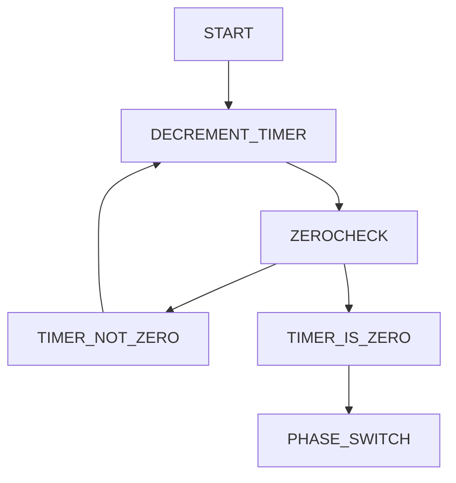
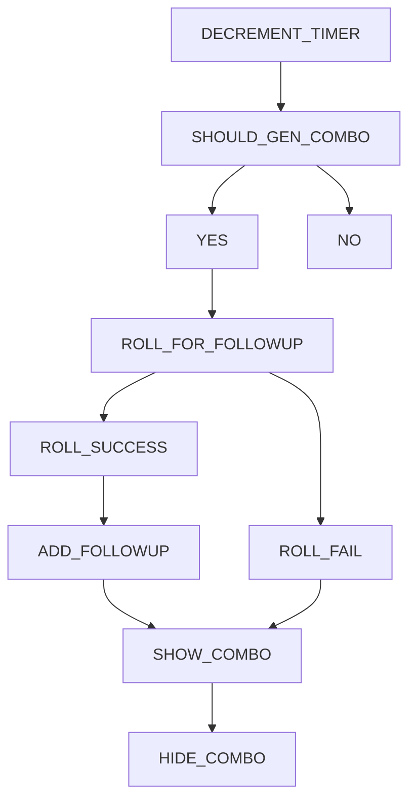

# Combo Coach Boxing

## About

Combo Coach Boxing is a boxing timer designed to keep the workout engaging by generating combos and randomly-timed follow up sequences.  It can be used when training on either the heavy bag, double-end bag, or shadow-boxing to improve your boxing skills or to have an excellent guided workout.

## Purpose

The motivation behind this project was to help the creator gain an understanding of how to use react hooks to manage state and encapsulate logic, maintaining a cleaner app structure, displaying data in graphs, as well as to solve a small, real-world problem.

## SUMMARY

### Dependencies
```
"recharts": "^2.1.9",
"axios": "^0.25.0",
"react": "^17.0.2",
```

### Global State

A context wrapper provides the global state...

FILE LOCATION: /src/context/ContextProvider.jsx
```
const ContextProvider = (props) => {
  ...
    return (
        <AccountContext.Provider value={accountValue}>
            < WorkoutContext.Provider value={workoutValue} >
                <DropdownContext.Provider value={dropdownValue}>
                    <ModalContext.Provider value={modalValue}>
                        {props.children}
                    </ModalContext.Provider>
                </DropdownContext.Provider>
            </WorkoutContext.Provider >
        </AccountContext.Provider>
    )
};
```

...and is wrapped around the App Component

FILE LOCATION: /src/App.js

```
function App() {
  return (
    <ContextProvider>
      <div className="App">
        <Home />
      </div>
    </ContextProvider>
  );
}
```


#### State Objects

<details>
   <summary>account</summary>
  <h3>File Location: /src/hooks/useAccount.js</h3>
  
  ```
  {
    isAuthenticated: BOOLEAN      //indicates if the user is logged in
    token: STRING                 //holds token response from server
    currentUser: OBJECT           //user's account details
  }
  ```
  
</details>


<details>
   <summary>profile</summary>
  <h3>File Location: /src/hooks/useAccount.js</h3>
  
  ```
  {
    roundsCompleted: NUMBER     //total lifetime rounds for account
    maneuverTracker: OBJECT     //total amount of times each maneuver was performed for account
    completedWorkouts: ARRAY    //contains an array of previous workouts.  used to calculate rounds completed per week
    loading: BOOLEAN            //handles loading state for retrieving profile information from server
  }
  ```
</details>

<details>
   <summary>workout</summary>
  <h3>File Location: /src/hooks/useWorkout.js</h3>
  
  ```
  {
    currentRound: NUMBER,       //current round of workout
    totalRounds: NUMBER,        //total number of rounds in current workout
    roundTime: NUMBER,          //time in each round
    currentTime: NUMBER,        //the current time left in current workout phase in seconds
    restTime: NUMBER,           //time in each rest period
    countDown: NUMBER,          //time buffer between hitting start and the workout beginning
    roundChangeWarning: NUMBER, //when currentTime reaches this number, it will trigger a warning sound
    rate: NUMBER,               //the rate at which new combos appear on the screen.  Enumerated values held in constants file.
    followupChance: NUMBER,     //rate at which a combo will trigger a followup, held as percentage value.
    comboStartTime: NUMBER,     //time which current combo started; referenced when checking if combo should be hidden.
    timerActive: BOOLEAN,       //indicates that the timer should be decremented with each passing second.
    isComplete: BOOLEAN,        //indicates whether the current workout has been completed
    inProgress: BOOLEAN,        /indicates whether a workout is in progress
    showCombo: BOOLEAN,         /indicates whether a combo should be shown on the screen
    showFollowup: BOOLEAN,      //indicates whether a followup should accompany the current combination
    combo: ARRAY,               //current combination
    followup: ARRAY,            //current followup
    combos: ARRAY,              //set of combos that the workout will choose from
    maneuverTracker: OBJECT,    //maneuver count for current workout
    currentPhase: STRING,       //Current phase of workout.  Enum values held in constants file
    followupClass: STRING       //handles dynamic styles for followups
  }
  ```
</details>

<details>
   <summary>modal</summary>
  <h3>File Location: /src/hooks/useModal.js</h3>
  
  ```
  {
    options: BOOLEAN            //indicates whether the workout options modal should be shown
    account: BOOLEAN            //indicates whether the account information / auth modal should be shown
  }
  ```
</details>

<details>
   <summary>dropdown</summary>
  <h3>File Location: /src/hooks/useDropdown.js</h3>
  
  ```
  //all handle corresponding dropdown selection in the <Options/> component
  {
      totalRounds: false,
      restTime: false,
      roundTime: false,
      countDown: false,
      roundWarningInterval: false,
  }
  ```
</details>


### Timer functionality overview



### Combo generation overview

